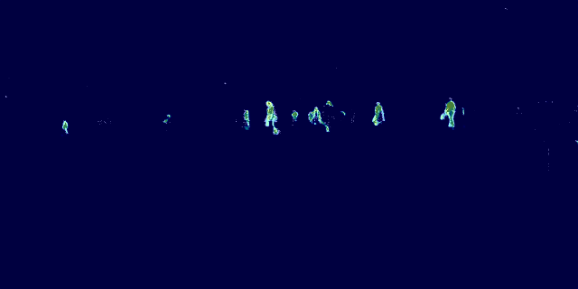

# eseg

Event-based depth/segmentation research package with ConvLSTM models, data utilities, and live camera streaming helpers.



## Features

- ConvLSTM-based models for event-stream inference
- Event voxelization and preprocessing helpers
- Utilities for HDF5/AEDAT4/RAW event data
- Live streaming pipeline for Prophesee and DAVIS cameras
- Training helpers (losses, plotting, and evaluation utilities)

## Python compatibility

This release currently targets **Python 3.12**.

## Installation

Install from PyPI:

```bash
pip install eseg
```

Install from source (development):

```bash
git clone <your-repository-url>
cd eseg
python -m venv .venv
source .venv/bin/activate  # Linux/macOS
pip install -e .[dev]
```

## Optional runtime dependencies for live cameras

For camera streaming, install one or both vendor SDKs:

- Prophesee: [Metavision SDK](https://docs.prophesee.ai/stable/get_started/get_started_python.html)
- iniVation DAVIS: [dv-processing](https://dv-processing.inivation.com/master/index.html)

If you use GPU inference/training, install a CUDA-enabled PyTorch build first:
[https://pytorch.org/get-started/locally/](https://pytorch.org/get-started/locally/)

## Quick start

```python
import eseg
from eseg.models.ConvLSTM import EConvlstm

print(eseg.__version__)
model = EConvlstm(light=False)
```

## Run live stream

```bash
python -m eseg.stream --help
```

Example:

```bash
python -m eseg.stream -m full --slice-time-ms 100
```

## Development

Run tests:

```bash
pytest
```

## License

MIT License. See LICENSE.

## Notes

This is research-oriented software; interfaces may evolve between releases.
